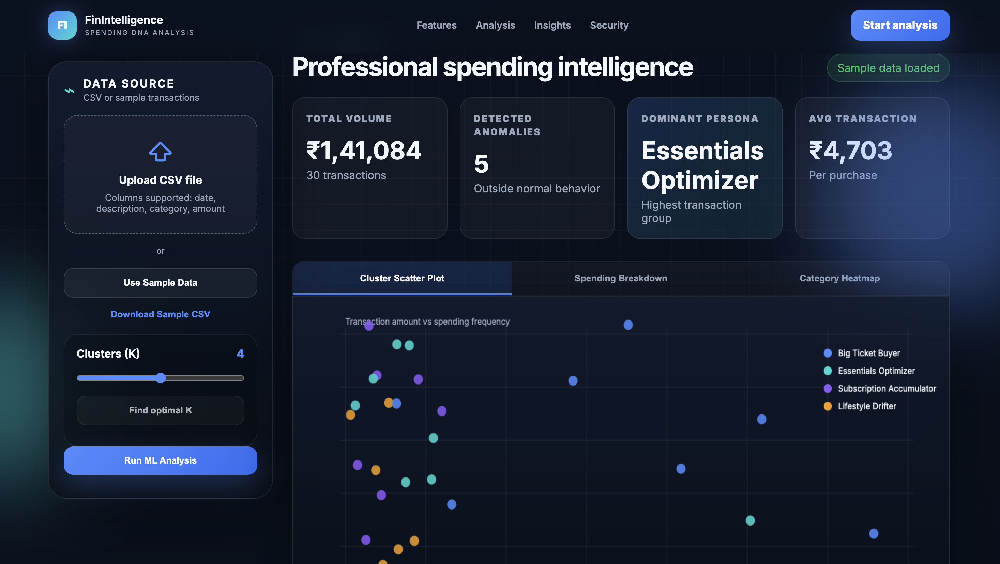
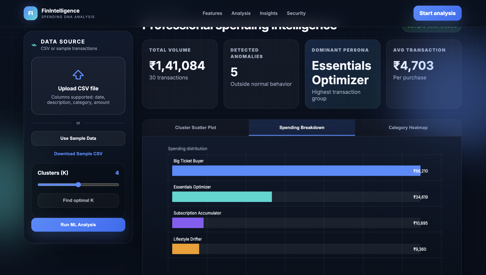
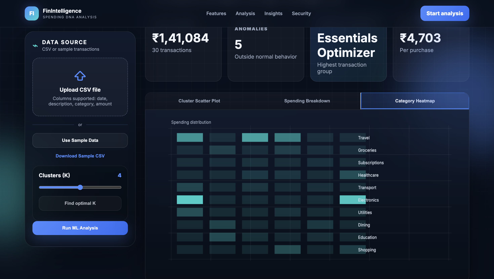

# finintelligent-project
Financial intelligence is a  platform with smart analytics, interactive dashboards, and modern responsive UI.

Financial intelligence is a platform designed to provide smart analytics, financial insights, and an interactive user experience.

## Features
- Modern responsive UI
- Financial analytics dashboard
- AI-powered insights
- Interactive charts and sections
- User-friendly design

## Technologies Used
- HTML
- CSS
- JavaScript

## Project Preview

## Live Demo
[View Live Project](https://vidushi2133.github.io/finintelligent-project/)

## Author
Vidushi Jain
